# UI 优化方案

本计划旨在系统性地提升 ZNC App 的整体视觉质量和用户体验，核心是遵循现代 UI 设计准则，同时保证不影响任何现有业务逻辑。

## 1. 建立设计体系 (Design System)

这是提升 UI 质感的基础。一个好的应用都有一套统一的设计语言。

*   **字体层次 (Typography):** 在 `ui/theme/Type.kt` 文件中，根据设计指南，建立一套清晰的字体规范。
    *   **大标题 (Headline):** 用于页面标题，醒目清晰。
    *   **子标题 (Subtitle):** 用于控件分组的标签，如“颜色模式”、“手动调节”。
    *   **正文 (Body):** 用于显示数值、状态等信息。
    *   **按钮文本 (Button):** 统一所有按钮的文字样式。
*   **色彩方案 (Color Scheme):** 优化 `ui/theme/Color.kt` 中的色彩定义。
    *   定义清晰的 `Primary` (主色，用于交互元素和高亮)、`Surface` (背景色) 和 `On-`系列颜色 (在主色/背景色之上的文字和图标颜色)。
    *   选择一个更精致的绿色作为主色，并搭配更具层次感的深灰色背景，提升整体的专业感。

## 2. 重构选择器屏幕 (`SelectScreen.kt`)

```mermaid
graph TD
    A[SelectScreen] --> B(ConnectionBar);
    A --> C(ButtonGrid);

    subgraph ConnectionBar
        B --> B1(IP Address & Latency);
        B --> B2(Connect Button);
    end

    subgraph ButtonGrid
        C --> C1(Row 1: A1, B1, C1, D1);
        C --> C2(Row 2: A2, B2, C2, D2);
        C --> C3(Row 3: A3, B3, C3, D3);
        C --> C4(Row 4: A4, B4, C4, D4);
    end

    style B fill:#222,stroke:#333,stroke-width:2px
    style C fill:#222,stroke:#333,stroke-width:2px
```

*   **顶部连接栏:**
    *   **布局:** 重新组织 IP 地址和延迟的显示，让它们在视觉上成为一个整体。
    *   **样式:** 为 IP 地址应用“正文”样式，为延迟应用更低调的“说明”样式。连接/断开按钮将使用新的主色，使其更醒目。
*   **按钮网格:**
    *   **间距与形状:** 增加按钮之间的间距，让布局更“透气”。按钮的圆角会稍微调整，使其看起来更柔和。
    *   **状态区分:** 优化选中状态的视觉效果。例如，使用“主色边框 + 半透明主色背景”来代替当前的纯色填充，这样既能清晰地区分状态，又不会过于刺眼。

## 3. 重构颜色控制屏幕 (`ColorScreen.kt`)

```mermaid
graph TD
    A[ColorScreen] --> B(Color Sliders);
    A --> C(Mode Selection);
    A --> D(Manual Input);

    subgraph Color Sliders
        B --> B1(Red Slider);
        B --> B2(Yellow Slider);
        B --> B3(Blue Slider);
    end

    subgraph Mode Selection
        C --> C1(Mode Buttons: 红, 黄, 堡, 紫);
    end
    
    subgraph Manual Input
        D --> D1(Value TextField);
        D --> D2(Decrement Button '-');
        D --> D3(Increment Button '+');
    end

    style B fill:#222,stroke:#333,stroke-width:2px
    style C fill:#222,stroke:#333,stroke-width:2px
    style D fill:#222,stroke:#333,stroke-width:2px
```

*   **整体布局:** 使用卡片 (Card) 或分组 (Column with border) 的方式，将“滑块”、“模式选择”、“手动输入”这三个功能区在视觉上清晰地分离开，形成有条理的布局。
*   **滑块区域:**
    *   **标签与数值:** 为每个滑块添加清晰的标签（Red, Yellow, Blue），并实时显示当前的数值。
*   **模式选择:**
    *   **按钮样式:** 使用 `OutlinedButton` (描边按钮) 作为默认状态，`Button` (填充按钮) 作为选中状态，让当前激活的模式一目了然。
*   **手动输入:**
    *   **样式:** 将输入框和 `+`/`-` 按钮组合在一起，使用 `OutlinedTextField` 样式，使其更现代化。